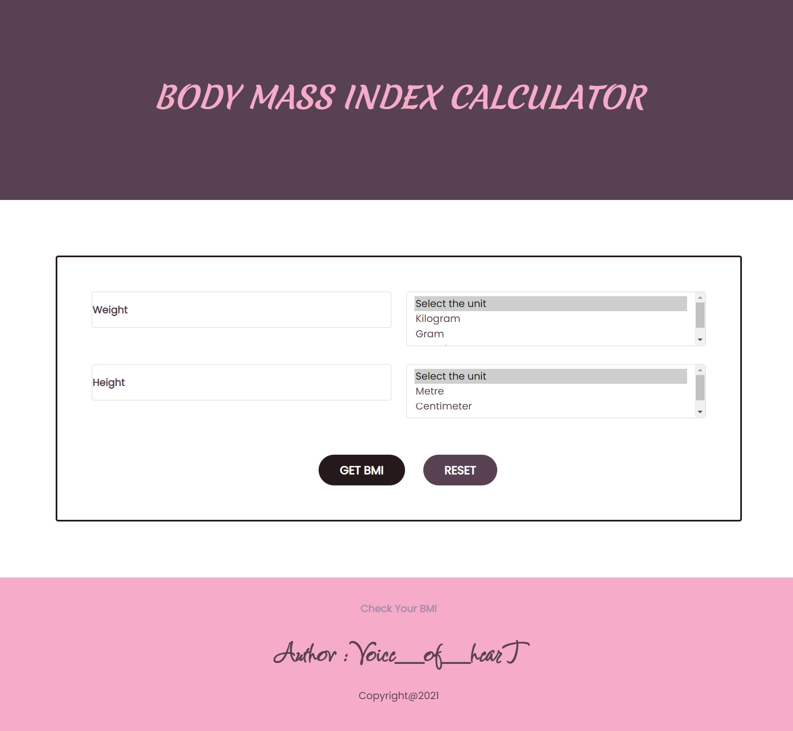
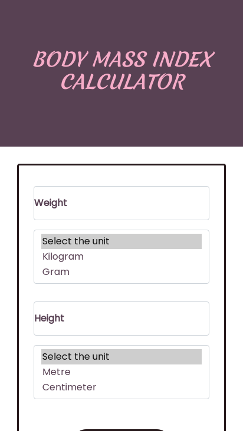

# bmi_calculator
website that calculate BMI (Body Mass Index)

## Table of contents

- [Overview](#overview)
- [Screenshot](#screenshot)
- [Links](#links)
- [My process](#my-process)
- [Built with](#built-with)
- [What I learned](#what-i-learned)
- [Continued development](#continued-development)
- [Useful resources](#useful-resources)
- [Author](#author)

## Overview
```
BMI = weight / height^2
```
where weight in kg and height in m ( metric system )</br>
other options of units also given.

### Screenshot

## Desktop
 
## Mobile
 
### Links

- Solution URL: [https://github.com/mansi05041/bmi_calculator]
- Live Site URL: [https://bmi-calculator-livid.vercel.app/]

## My process

To make website i used Bootstrap for form input & adjust in row format.

### Built with

- Semantic HTML5 markup
- CSS custom properties
- Javascript
- Mobile-first workflow
- Bootstrap

### What I learned

```html
  <div class="row">

        <div class="form-floating mb-3 col-lg-6">
          <input type="text" class="form-control weight_input" id="floatingInput" placeholder="Weight">
          <label for="floatingInput">Weight</label>
        </div>

        <div class="col-lg-6">
          <select class="form-select weight_units" size="3" aria-label="size 3 select example">
            <option selected>Select the unit</option>
            <option value="1">Kilogram</option>
            <option value="2">Gram</option>
            <option value="3">Pound</option>
          </select>
        </div>

      </div>

```
learn select use through bootstrap

### Continued development

More options will be added like Age range and Gender radio

### Useful resources

- [w3schools](https://www.w3schools.com/css/css_rwd_mediaqueries.asp) - This helped me for understanding the media querry.
- [MDN](https://developer.mozilla.org/en-US/) - This is helpful in implementation of javascript.
- [Bootstrap](https://getbootstrap.com/) - This helped in form input & row adjustment.

## Author

- Frontend Mentor - [@mansi05041](https://www.frontendmentor.io/profile/mansi05041)
- Linkedin - [mansi joshi](https://www.linkedin.com/in/mansi-joshi-663aa81a0/)
